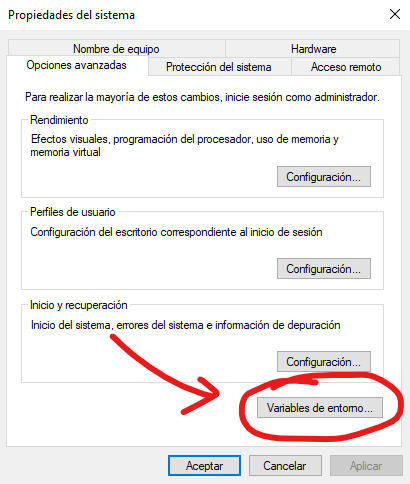
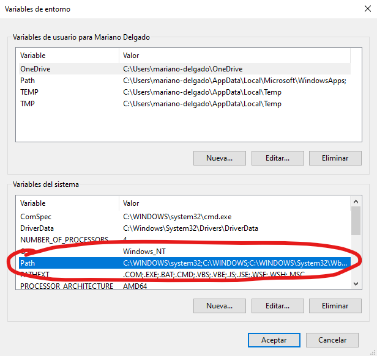

<center></center>

- [Pero esto qué es???](#pero-esto-qué-es)
- [Todo eso está muy bien, pero cuántas perras tengo que soltar?](#todo-eso-está-muy-bien-pero-cuántas-perras-tengo-que-soltar)
- [Y dónde está el truco?](#y-dónde-está-el-truco)
- [Y cómo hago para jugar?](#y-cómo-hago-para-jugar)
- [Pero el código está aquí mismo, no puedo hacer que funcione?](#pero-el-código-está-aquí-mismo-no-puedo-hacer-que-funcione)
  - [Compilar en Windows 10 (seguramente funcione también con Windows 11).](#compilar-en-windows-10-seguramente-funcione-también-con-windows-11)
  - [Compilar en Ubuntu (seguramente funcione también con cualquier sistema operativo Linux basado en Debian)](#compilar-en-ubuntu-seguramente-funcione-también-con-cualquier-sistema-operativo-linux-basado-en-debian)

# Pero esto qué es??? 

Pues qué va a ser, ignorante de la vida. Un homenaje a la que probablemente sea la mejor serie de comedia de España: [Aquí No Hay Quien Viva](https://anhqv.eu/).

Revive las peleas más épicas de la serie (o invéntate tus propios combates) en este juegazo hecho con todo el cariño que he podido encontrar en mi corazón y un poco más que he ido encontrando por ahí.

# Todo eso está muy bien, pero cuántas perras tengo que soltar?

0 €.

# Y dónde está el truco?

El truco es que a lo mejor tardo meses en sacar actualizaciones jejej. Esto lo hago por amor al arte, así que no me toques los cojones con las prisas, que estoy de presiones y estreses hasta aquí, y un juego entero con sus personajes y sus menús y todo como comprenderás no lo voy a hacer en una semana. Pero de buen rollo, eh? Que tú y yo vamos a ser muy buenos amigos.

# Y cómo hago para jugar?

Ahora mismo por desgracia no se puede descargar el juego, le faltan unos cuantos retoques.

# Pero el código está aquí mismo, no puedo hacer que funcione?

Pues sí, puedes hacerlo. A continuación hay varios apartados con instrucciones sobre cómo convertir todo este montón de código en un juego (a esto los frikis le llamamos *compilar*, así que a partir de ahora voy a llamarlo así).

## Compilar en Windows 10 (seguramente funcione también con Windows 11).

- Paso 1: **Descargar e instalar MSYS2.**

MSYS2 es una cosa chulísima para poder compilar programas para Windows. En la [página oficial](https://www.msys2.org/) hay instrucciones sobre cómo descargarlo e instalarlo, pero están en inglés, y entiendo que aquí a lo mejor hay gente que no pasa del "Hello Molly, how are you doing today?", así que mejor lo explico aquí sobre la marcha.

En [este enlace](https://github.com/msys2/msys2-installer/releases/download/2025-12-13/msys2-x86_64-20251213.exe) te puedes descargar el instalador. Cuando se termine de descargar, ábrelo y sigue las instrucciones (aunque simplemente será darle a Next una y otra vez porque tampoco hay mucho que hacer).

En cuanto se termine de instalar, se abrirá una ventanita negra. Esta ventana será necesaria para poder seguir con el paso 2. Si no se ha abierto, pulsa la tecla Windows y escribe MSYS2 UCRT64. Saldrá un iconito con una M blanca sobre un fondo de un color así amarillo verdoso medio oscuro pocho que no sé describir. Pulsa Enter para que se abra la ventana negra.

- Paso 2: **Descargar e instalar las herramientas necesarias.**

Una vez se abre la ventanita negra de MSYS2, puedes instalar los compiladores y programas que hacen falta para poder compilar el juego. Las instrucciones están en [este enlace](https://www.mingw-w64.org/getting-started/msys2/), pero como también están en inglés, las pongo aquí para el que no se entere. Ejecuta el siguiente comando (puedes copiar y pegar, pero no hagas Control+V en la ventana negra porque se va a liar. Mejor haz clic derecho -> Paste (que significa Pegar en inglés)):

```bash
pacman -S mingw-w64-ucrt-x86_64-gcc
```

Ahora escribe `Y` y pulsa Enter. Todas las herramientas necesarias comenzarán a instalarse. Sabrás que ha terminado cuando aparezcan otra vez las letras en verde con tu nombre de usuario y el nombre de tu ordenador, junto con las letras en morado que dicen UCRT64.

A continuación, será necesario descargar dos herramientas adicionales. Ejecuta el siguiente comando:

```bash
pacman -S mingw-w64-ucrt-x86_64-cmake mingw-w64-ucrt-x86_64-ninja
```

El procedimiento es igual. Pulsa `Y` y luego pulsa Enter. Cuando termine de instalarse, podrás cerrar la ventana negra.

- Paso 3: **Descargar Git**

Git es una herramienta para compartir código con otras personas. En su [página oficial](https://git-scm.com/install/windows) hay instrucciones para instalarlo, pero también están en inglés, así que lo explicaré aquí en un momento.

Descarga git desde [este enlace](https://github.com/git-for-windows/git/releases/download/v2.52.0.windows.1/Git-2.52.0-64-bit.exe). Cuando se termine de descargar, abre el archivo descargado para instalarlo. Aquí no sirve simplemente con darle a Next un millón de veces, hay que tener cabeza.

La parte que habla sobre la licencia (GNU General Public License) no tiene mucho misterio, Next.

Luego te dirá dónde quieres instalar Git. Te dirá algo como `C:\Program Files\Git`, que está bastante bien. Next.

Luego te dejará cambiar algunas opciones adicionales, pero están bien así como están, Next.

Luego te dirá nosequé de una carpeta en el menú de inicio, le puedes dar a Next sin problema.

A partir de aquí la cosa se pone complicada. Ahora te piden confirmar qué editor de texto quieres usar con Git. Esto creo que se usaba para resolver conflictos raros si subes código que otra persona ha cambiado también y tienes que decidir qué partes tuyas se quedan y que partes de la otra persona se quedan etc etc. Mejor abre el desplegable y pon la opción de `Use Notepad as Git's default editor` (aunque si tienes instalado [Visual Studio Code](https://visualstudio.microsoft.com/es/downloads/) como yo, puedes poner la opción de `Use Visual Studio Code as Git's default editor`). Dale a Next.

Ahora, te pedirá nosequé del nombre de la rama inicial de nuevos repositorios. Eso lo puedes dejar como está (`Let Git decide`). Next.

Luego te dirá cosas del PATH. Puedes dejar marcada la opción de enmedio. Next.

A continuación, te dejará elegir un ejecutable para SSH. Esto sirve para establecer conexiones seguras y descargar código sin que haya rusos espiándote. Puedes dejar marcada la opción de `Use bundled OpenSSH`. Next.

Después, te dirá que especifiques más cosas sobre conexiones seguras. Puedes dejar la opción que está marcada (`Use the native Windows Secure Channel library`). Next.

Ahora, te dirá que especifiques cosas para código que funciona tanto en Windows como en otros sistemas operativos. Puedes dejarlo como está, ya que está hecho para funcionar bien en todos los sistemas operativos (`Checkout Windows-style, commit Unix-style line endings`). Next.

Venga que ya estamos terminando. Ahora, te dirá nosequé de un terminal. Déjalo tal cual está (`Use MinTTY (the default terminal of MSYS2)`). Next.

Luego, te dirá nosequé del comportamiento del comando `git pull`. Déjalo tal cual está (`Fast-forward or merge`). Next.

La penúltima opción es elegir qué gestor de credenciales quieres usar. Puedes dejar el que está elegido por defecto (`Git Credential Manager`). Next.

El último paso consiste en opciones extra. Puedes dejarlo tal cual está. Dale a Install para instalar Git.

En cuanto termine de instalar, puedes desmarcar la casilla de `View Release Notes` y darle a Finish.

- Paso 4: **Indicarle al ordenador dónde están todas las herramientas descargadas**

Tal y como está la cosa, por muchas herramientas chulas que nos hayamos instalado, el ordenador no va a saber encontrarlas. Pulsa la tecla Windows y escribe `Variables de entorno`. Pulsa Enter. Saldrá una ventana blanca con botones grises. Haz clic en un botón gris abajo en el que pone `Variables de entorno...`.



Aparecerá una ventana con mucha información. Arriba pondrá "Variables de usuario para (nombre de tu usuario)". Dentro del recuadro blanco de arriba, aparecerá una variable que se llama `Path`. Haz doble clic ahí.



Ahora, haz clic en el botón Nuevo de la derecha, escribe lo siguiente y pulsa Enter:

```
C:\msys64\ucrt64\bin
```

Lo normal es que las herramientas se hayan instalado en la unidad C. Si no sabes de lo que estoy hablando, no te preocupes. Si sabes de lo que estoy hablando y sabes que lo has instalado en otro sitio, puedes cambiar la C del principio por la letra correcta.

Dale al botón Aceptar que hay más abajo. Sigue dando a botones Aceptar y cerrando ventanas hasta que no queda nada.

- Paso 5: **Descargar el código**

Abre una terminal de comandos. Si no sabes cómo, pulsa la tecla Windows, escribe `cmd` y pulsa Enter. Se abrirá una ventana negra. Escribe el siguiente comando:

```bash
cd Desktop
```

Ahora te sitúas en tu escritorio. Para descargar el código, ejecuta el siguiente comando:

```bash
git clone https://github.com/tresDeCopas/Erase-Un-Combate
```

El código del juego se descargará dentro de una carpeta llamada `Erase-Un-Combate` en tu escritorio.

- Paso 6: **Compilar el código**

Ahora, ejecuta el siguiente comando en la ventana negra:

```bash
cd Erase-Un-Combate
```

Con esto, te moverás hacia dentro de la carpeta que acabas de descargar (si has movido la carpeta a otro lado, esto no servirá. Tendrás que poner `cd` seguido de la ruta hacia el sitio donde has puesto la carpeta. También puedes devolver la carpeta al escritorio, que seguramente sea más fácil).

Ahora, crea una carpeta llamada `build` dentro de la carpeta `Erase-Un-Combate`. Esto lo puedes hacer con el siguiente comando:

```bash
mkdir build
```

A continuación, métete dentro de la carpeta recién creada con el siguiente comando:

```bash
cd build
```

Ahora, ejecuta este comando para preparar todo lo necesario para la compilación:

```bash
cmake .. -G Ninja
```

Cuando termine de prepararlo todo, ejecuta `ninja` para compilar el juego.

- Paso 7: **Jugar**

Si todo ha ido bien, podrás ir a la carpeta que hay antes con `cd ..`, y ejecutar el juego con `EraseUnCombate.exe`.

## Compilar en Ubuntu (seguramente funcione también con cualquier sistema operativo Linux basado en Debian)

En este caso compilar es infinitamente más fácil que en Windows.

- Paso 1: **Descargar dependencias**

Abre una terminal de comandos (si usas Linux supongo que sabes cómo hacerlo, pero si no, haz Control+Alt+T). Escribe los siguientes comandos para instalar las dependencias necesarias:

```bash
sudo apt update

sudo apt install cmake git ninja-build gcc g++ curl libmbedtls-dev libharfbuzz-dev libssl-dev libcurl4-openssl-dev libxrandr-dev libxcursor-dev libxi-dev libudev-dev libfreetype-dev libflac-dev libvorbis-dev libgl1-mesa-dev libegl1-mesa-dev libfreetype-dev
```

- Paso 2: **Descargar el código**

Dirígete al directorio que más te guste para descargar el código. Una vez estés ahí, ejecuta el siguiente comando:

```bash
git clone https://github.com/tresDeCopas/Erase-Un-Combate
```

Sitúate dentro del directorio descargado con el siguiente comando:

```bash
cd Erase-Un-Combate
```

- Paso 3: **Compilar**

Una vez dentro del directorio `Erase-Un-Combate`, crea un directorio `build` y muévete hacia él con los siguientes comandos:

```bash
mkdir build

cd build
```

A continuación, prepara los ficheros para la compilación con el siguiente comando:

```bash
cmake .. -G Ninja
```

Y compila con el siguiente comando:

```bash
ninja
```

- Paso 4: **Jugar**

Muévete al directorio padre con `cd ..` y ejecuta el juego con `./EraseUnCombate`.